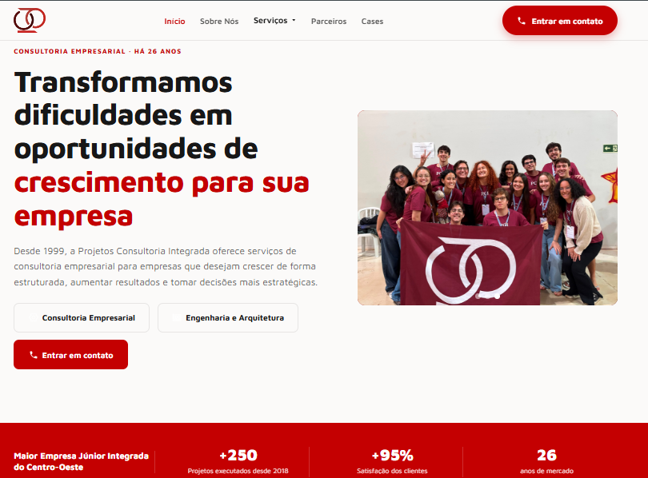

# 🌐 Site Institucional - Projetos Consultoria Integrada (PCI)

Este repositório contém o código-fonte do site institucional da **Projetos Consultoria Integrada (PCI)**, uma empresa júnior comprometida com a excelência em consultoria e soluções integradas para empresas e organizações.


### Desenvolvedores
- **👤💻 [corvinyy (Lorena Araujo)](https://github.com/corvinyy)**
- **👤💻 [Luis Moura](https://github.com/luismoura-10)**

*MODELO ANTIGO*


---

*MODELO ATUAL*



`projeto desenvolvido para a Projetos Consultoria Integrada`

### 📁 Estrutura do Projeto

```bash

PCI-SITE/
├── assets/ # Imagens, ícones e logos
│ ├── icons/
│ ├── img/
│ └── logos/
├── css/
│ └── style.css # Estilos do site
├── js/
│ └── script.js # Scripts JS do site
├── pages/ # Páginas internas do site
│ ├── inicio.html
│ ├── sobre nós.html
│ ├── consultorias.html
│ ├── arquitetura.html
│ ├── parcerias.html
│ └── cases.html
├── index.html # Página inicial (Início)
└── CNAME
└── README.md
```

## 🛠️ Tecnologias utilizadas


<br></br>
---

### 🧩 Páginas

- Início: Apresentação da empresa e navegação principal
- Sobre Nós: Informações sobre a história, MVV e Diretoria
- Serviços:
    ○ Consultoria: Lista de soluções de consultorias;
    ○ Arquitetura: Lista de soluções de arquitetura.
- Parceiros: Lista de parceiros da PCI
- Cases: Cases de sucesso e depoimentos

---
### 💡 CURIOSIDADES
- Site totalmente responsivo
- Botão de Whatsapp conectado ao contato da empresa com mensagem automática
- Botão para voltar ao topo da página
- Carrosseís de imagens
- Botão de cartela de serviços
- Localizaçção da empresa  no Google Maps 

---

### 🚀 Como Rodar o Projeto Localmente

Como o site é 100% front-end (HTML, CSS e JS), não há necessidade de servidor backend.
Você pode abrir o projeto localmente de maneira bem simples:

**1. Faça o clone do repositório** 

```bash
https://github.com/corvinyy/projetosintegrada.git
```

**2. Acesse a pasta do projeto**  

```bash
cd projetosintegrada
```

**3. Dê duplo clique no arquivo ``index.html`` ou utilize a extensão ``Live Server`` no VSCode**

---

### 📫 Contato

- 🌐 Site: https://projetosintegrada.com.br/
- 📞 Telefone: (61) 99853-8516
- 📧 E-mail: negocios@projetosintegrada.com.br
- 📍 Localização: SEPN 707/907, Ceub - Asa Norte, Bloco 2, Sala 2311 CEP: 70790-075

---

### 🔹 ICONS - CRÉDITOS

<div> 
    Icons feitos por
    <a href="https://www.flaticon.com/br/autores/pod-gladiator" title="POD Gladiator"> POD Gladiator </a>  
    e <a href="https://www.flaticon.com/br/autores/ilham-fitrotul-hayat" title="Ilham Fitrotul Hayat"> Ilham Fitrotul Hayat </a>do <a href="https://www.flaticon.com/br/" title="Flaticon">www.flaticon.com</a>
</div>

---
### 📝 Licença

``Este projeto é de uso institucional da Projetos Consultoria Integrada. Direitos reservados © 2026.``
